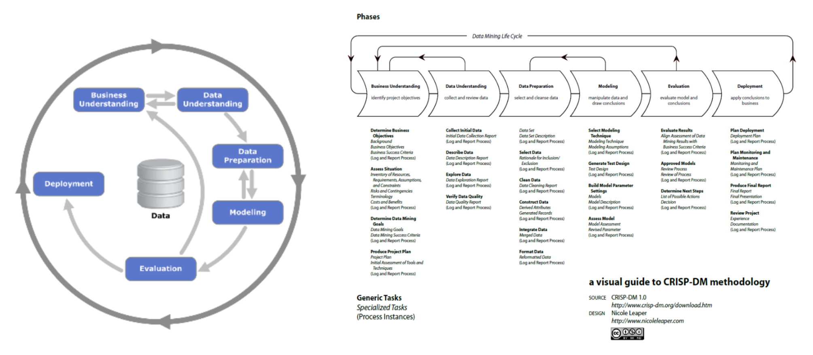

# PythonStudy

멀티캠퍼스에서 진행한 데이터사이언스/엔지니어링 수업 코드

## 데이터 분석 타임라인

1. 사업 이해
2. 데이터 이해
3. 데이터 preparing
   1. 데이터 준비
   2. 결측치의 처리
   3. 특징 추출 (Recursive Feature Elimination) 
   4. 데이터 정규화 
   5. 원 핫 인코딩으로 범주 변환 (One Hot Encoding) 
   6. 숫자 변수의 범주형 변수로 변환 
   7. PCA를 통한 차원 축소
   8. 파생 변수 생성
4. 모델링

5. 평가
6. 전개

